# Flows

Each flow below is a sequence diagram of the messages between roles. The
roles and tokens are introduced in [How AAuth works](how-aauth-works.md). Where
a step is a call you make, the diagram names the Go type. Where a role answers
on its own, the diagram shows the HTTP exchange.

The three-party, mission, and revocation flows follow the calls the library's
end-to-end scenario makes; run it with `AAUTH_E2E_TRACE=1` to see the same
sequence with real requests ([Testing](testing.md)). Section numbers refer to
draft -11, and [Protocol coverage](../specs/protocol-coverage.md) says what
the library implements of each.

In every diagram, each request from the agent is an HTTP message signature
made with the agent's own key. The token it carries rides in the
`Signature-Key` header.

## 1. Get an agent token

An agent token binds the agent's key to its identifier. How the agent gets one
depends on who runs its agent provider.

### Self-hosted

The agent is its own provider. It mints a token with its own key and serves
its metadata and JWKS so verifiers can check it. `Transport` mints a fresh
token for each request.

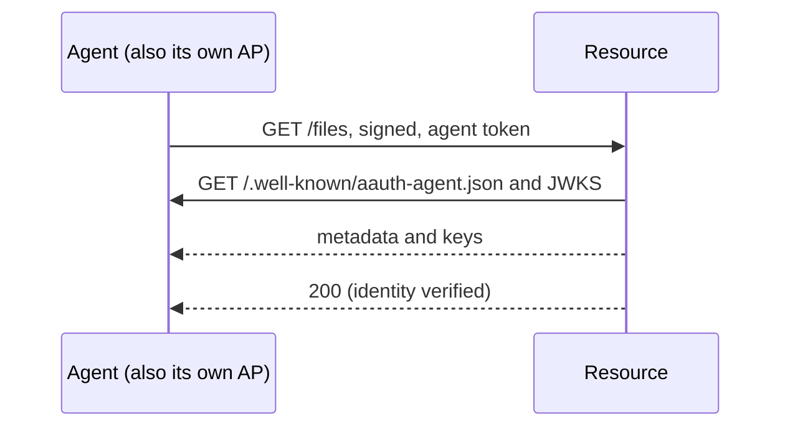

### Hosted: enroll and refresh

A hosted provider issues tokens for keys the application authorizes. An agent
enrolls by signing a request with the new key (the `hwk` scheme) and your
`Registrar` decides whether to issue. A durable key can later delegate to a
fresh ephemeral key (the two-key refresh), so the long-lived key stays out of
everyday requests.

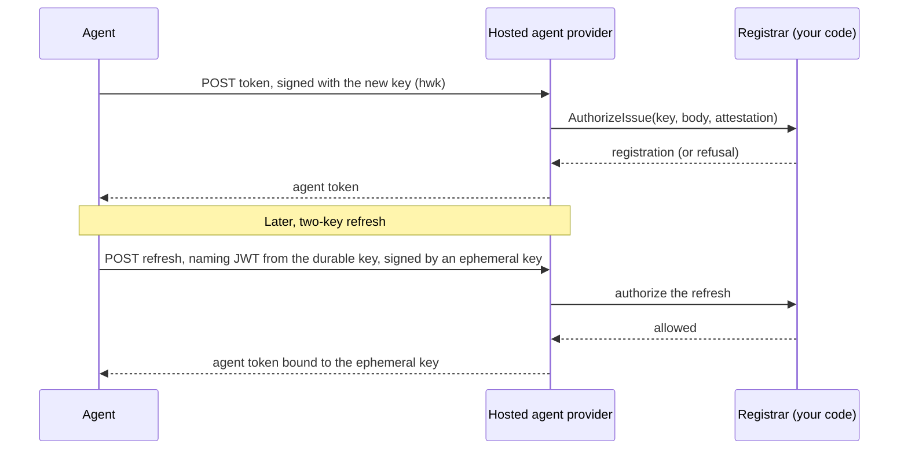

## 2. Identity only

A resource that needs only to know which agent is calling verifies the agent
token and serves. This is `VerifyAndExtractAgent`, and the shortest path
through the protocol.

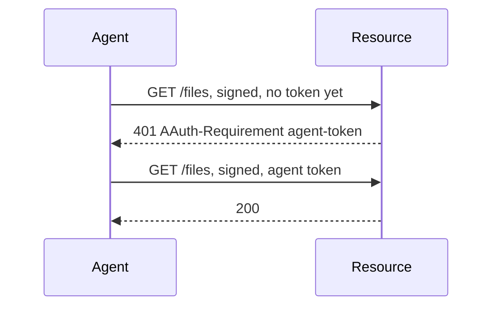

## 3. Three-party access

The resource wants a person's authorization. This is the full exchange for a
first request to a new resource.

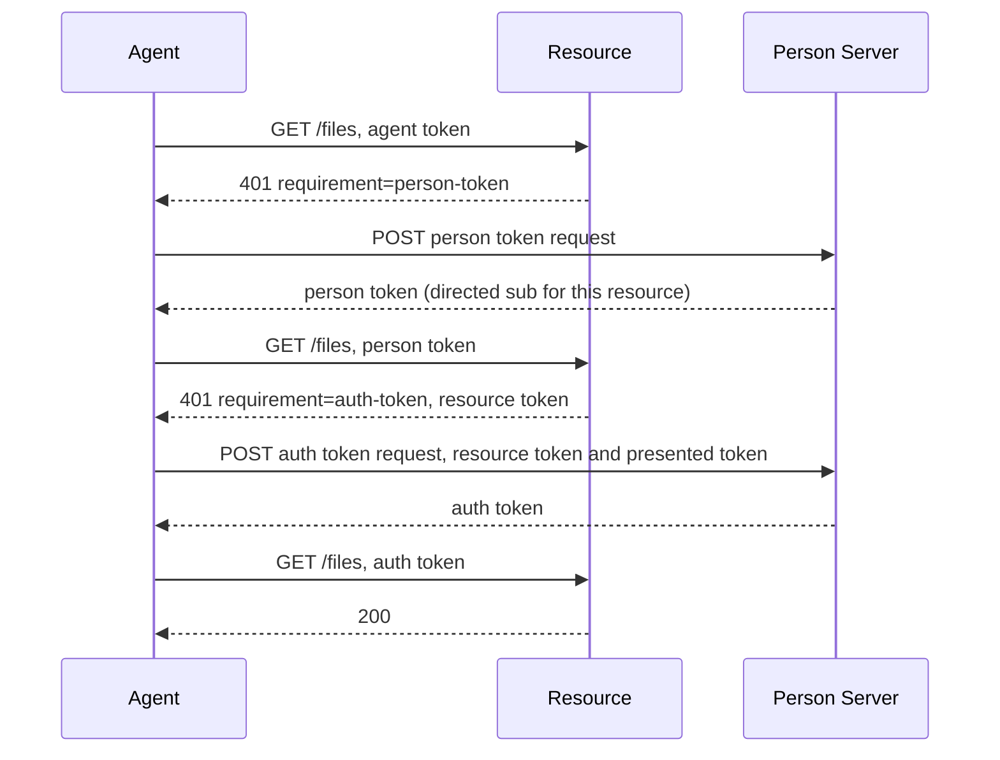

Points worth knowing:

- The person token carries a **directed** identifier. The PS derives it per
  resource from a keyed HMAC, so two resources cannot tell they are talking
  about the same person.
- The resource token names the token the request presented, and the PS checks
  the two together. The agent cannot swap in a different person's token.
- The agent checks the resource token and the auth token it receives before
  using them. `Transport` does all of this and retries the original request.
- Tokens are cached per resource and replaced shortly before they expire (a
  five-minute margin), so later requests skip most of these steps.

## 4. A new agent: consent

The first time a PS sees an agent, it has no person bound to it. Your `Decider`
defers, and the request waits while the person approves. Any AAuth endpoint can
answer `202` this way.

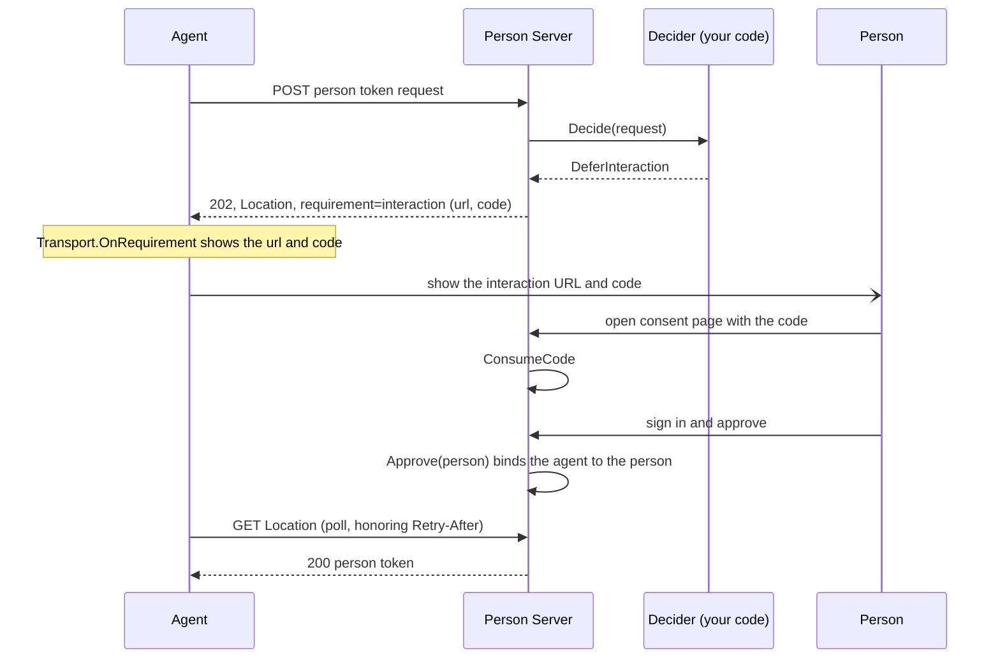

Each interaction code is single use. The hosting application authenticates the
person and calls `Approve`, `Deny`, or `Fail`; the library never decides. A
PS may instead ask a clarifying question before deciding:

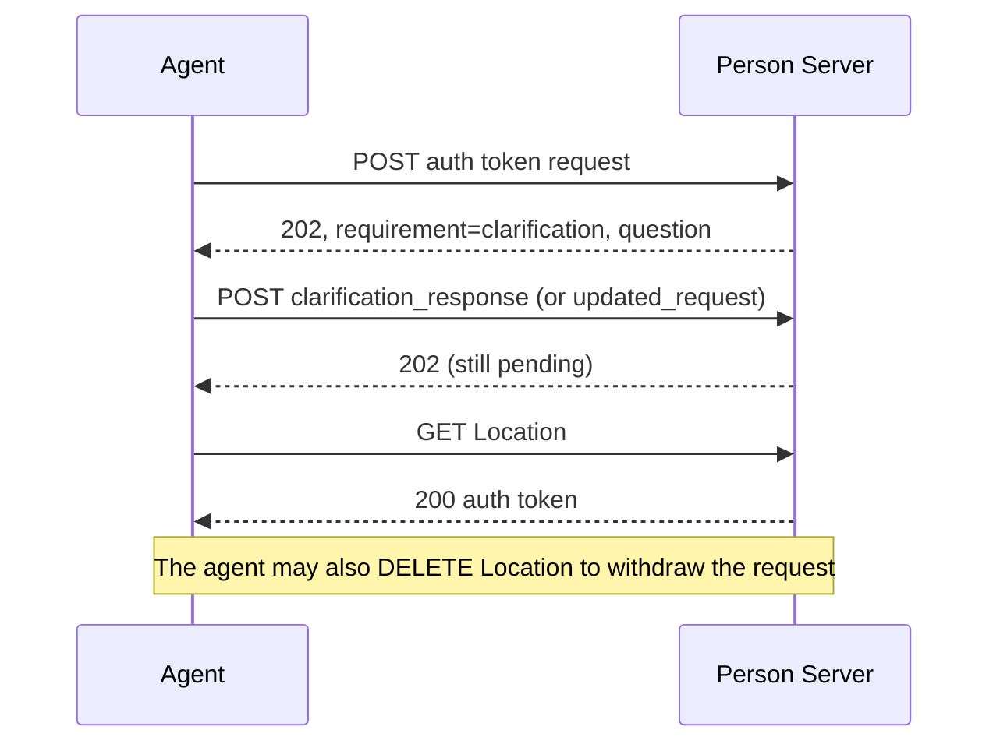

## 5. Four-party access

The resource's resource token names an Access Server as its audience. The agent
still talks only to its PS. The PS passes the request to the AS, which may
defer to the resource owner.

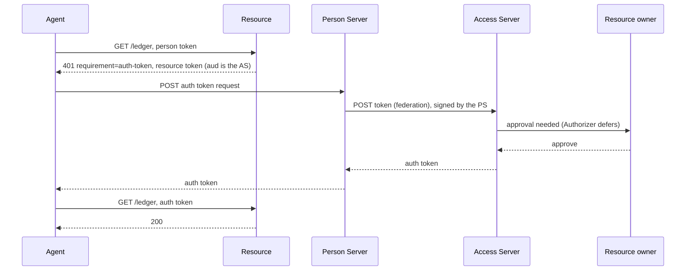

If the AS denies, the PS relays the refusal and the agent gets an error
instead of a token. With the collapsed deployment, the PS-to-AS step is an
in-process call (`Server.Local`) and nothing else changes.

## 6. A mission

A mission is a task the person approves once. The agent proposes it, the PS
returns a digest that names it exactly, and later tokens carry the digest, so
the AS or PS can judge each request against the task.

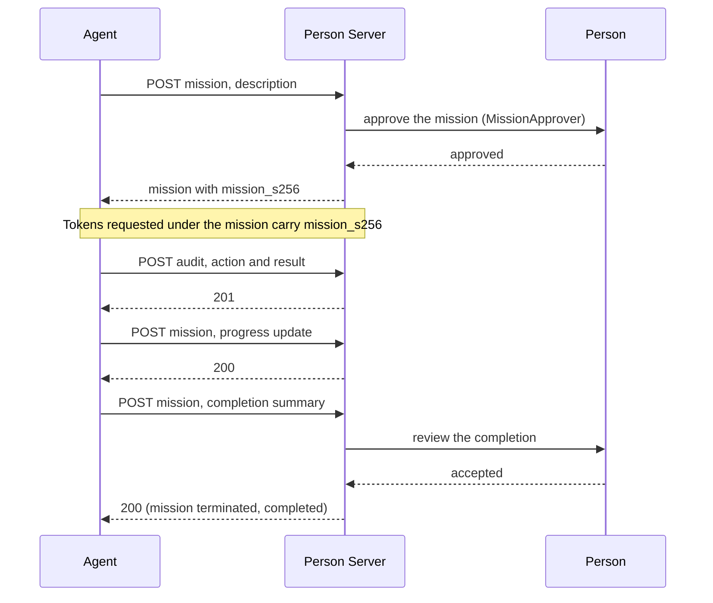

Set `Transport.MissionS256` and person and auth tokens are requested under the
mission. The PS keeps a log of each approval, token request, audit entry,
update, and completion. A terminated mission returns `*MissionStatusError`
from every PS endpoint.

## 7. Permission

For an action that is not a resource call, such as sending an email, the agent
asks the PS first. This works with or without a mission.

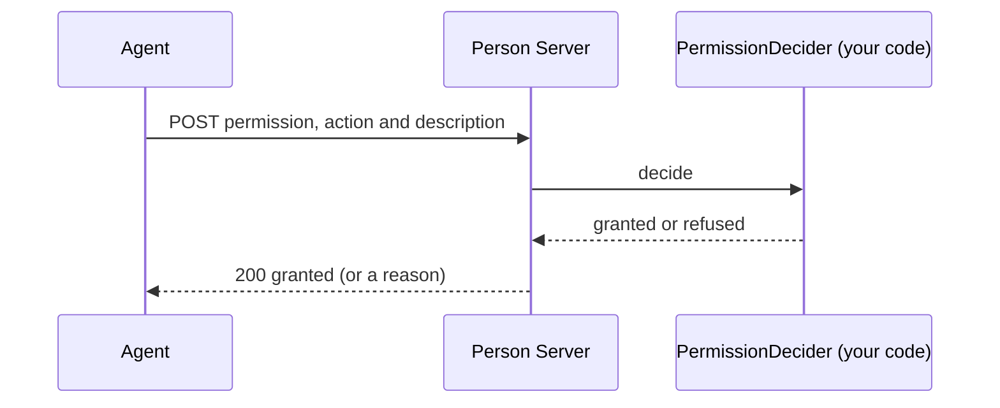

## 8. The resource asks the person directly

A resource may need its own interaction before authorizing, such as a consent
screen of its own. It answers with a `202` and `requirement=interaction`
(§6.2), and `Transport` follows it the same way as the PS consent flow in
section 4: it shows the URL and code through `OnRequirement` and polls the
pending location. A resource can also hand back an `AAuth-Access` session token
that is bound into later signatures and refreshed on any response.

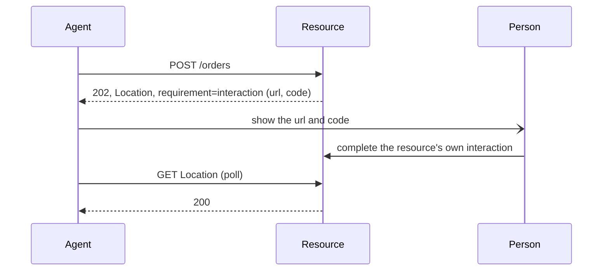

## 9. Call chaining

A resource that must call another resource to serve a request acts as an agent
itself. It has its own agent provider, identity, and key. It takes the PS from
the upstream token it received, and sends that token as `upstream_token`, so the
downstream tokens are issued for the same person and mission.

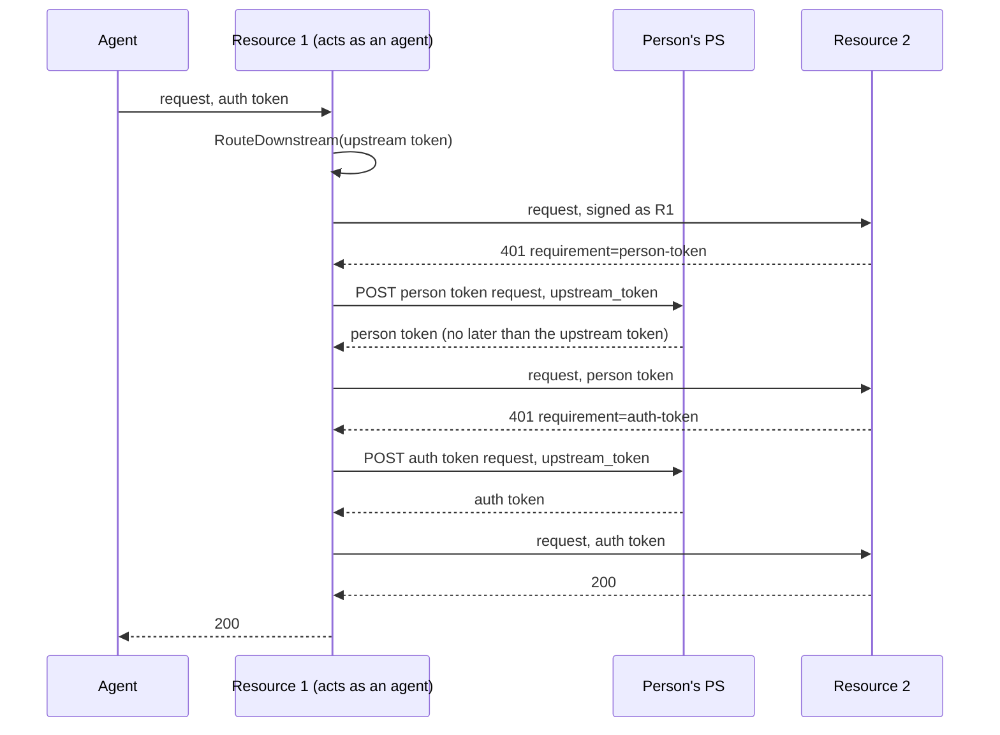

If the downstream resource needs a person, R1 can pass the interaction on to its
own caller with `ChainInteraction`, which returns R1's own `202`, and finishes
the original request when the person completes it.

## 10. Sub-agents

An agent can run a sub-agent with its own key, one level deep. The parent signs
the requests to the PS and attaches the sub-agent's token as `subagent_token`,
so the person and auth tokens bind the sub-agent's key. The sub-agent signs its
own requests to resources.

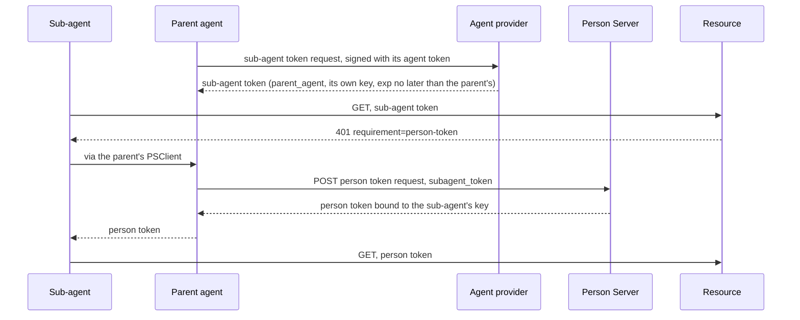

## 11. Revocation

Revoking an agent token cascades. The agent provider tells the PS, the PS
revokes what it issued to that agent at each resource, and an AS revokes its own
auth tokens at the resource.

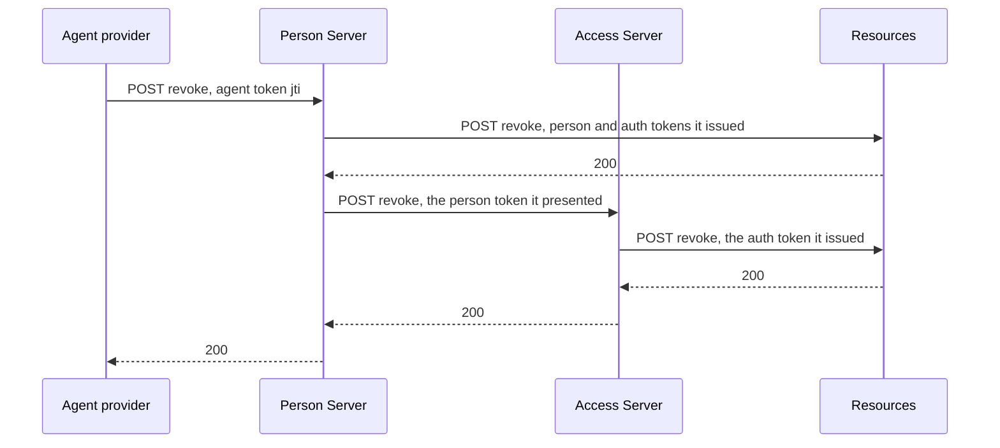

Afterwards the resource rejects the cached tokens, and the PS rejects the
revoked agent token, so the agent obtains nothing new. `Transport` drops a
cached person or auth token that a resource reports as expired or revoked, and
falls back to the next credential.

## Errors and waiting

Two behaviors apply to every flow above:

- **Deferred responses.** Any endpoint can answer `202` with a `Location`, and
  `Retry-After`. The agent polls with signed GETs, backs off on `429`, and stops
  on a non-`202` answer.
- **Failures.** A signature problem is a `401` with a `Signature-Error` code.
  Token endpoint and polling problems are RFC 9457 problem bodies. A
  `clock_skew` error makes `Transport` wait out the skew and send the same
  request once more.
