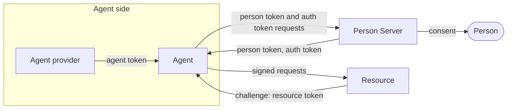
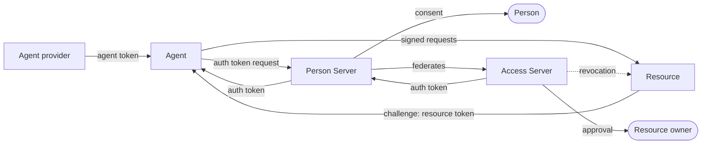
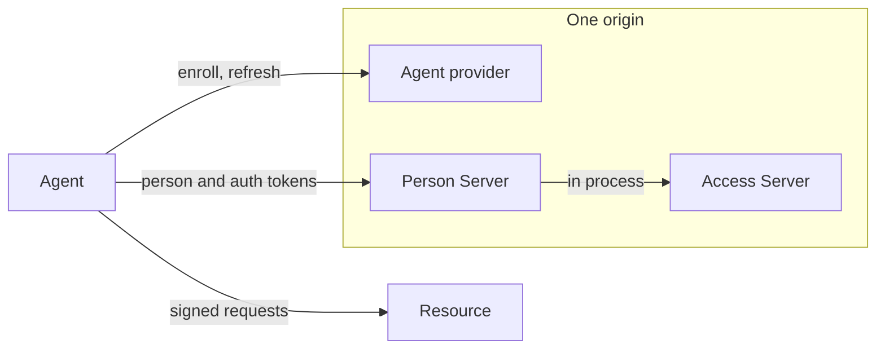

# How AAuth works

AAuth lets an **agent** call a **resource** in another trust domain without a
shared secret and without the resource knowing the agent in advance. Every
agent holds its own signing key. Each request is signed with that key, and a
token binds the key to an identity, so the resource can verify who is calling
and, when it needs more, ask someone who can vouch for the person behind the
agent.

This page explains the roles and how they fit together. The
[flows](flows.md) page walks through each exchange step by step, and the
[agent](agent.md), [resource](resource.md), and
[server](servers.md) guides show the Go code for each role.

## The roles

| Role | What it does | Go package |
|---|---|---|
| **Agent** | Signs every request with its own key and carries the tokens the other roles issue | `aauth` (`Agent`, `PSClient`, `Transport`) |
| **Agent provider (AP)** | Issues the agent token that binds an agent identity to its key. A self-hosted agent is its own AP; a hosted AP issues tokens for agents it enrolls | `aauth` (self-hosted), `agentprovider` (hosted) |
| **Resource** | Serves an API. Verifies the token a request presents and challenges for the next one | `aauth` (`VerifyAndExtract*`, `Challenge*`, `IssueResourceToken`) |
| **Person Server (PS)** | Represents the person behind an agent. Asks them for consent, issues person tokens and auth tokens, and keeps missions | `personserver` |
| **Access Server (AS)** | Decides access on a resource's behalf when the resource keeps its authorization separate from the person's PS | `accessserver` |

Every server role publishes a metadata document and a JWKS, so a verifier
finds a signer's keys from the identifier alone. That discovery is what
removes pre-registration.

## The tokens

Each token answers one question, and each role issues one kind.

| Token | Issued by | Says |
|---|---|---|
| Agent token | Agent provider | This key belongs to this agent identity |
| Person token | Person Server | The person behind this agent allows it to approach this resource, under a directed identifier that is different at every resource |
| Resource token | Resource | I will serve this agent for this scope. Take this to your PS |
| Auth token | PS (three-party) or AS (four-party) | This agent may do this at this resource. Present it to the resource |

A resource that needs only the agent's identity stops at the agent token. One
that needs a person, or a decision about scope, asks for the next token with an
`AAuth-Requirement` response header, and the agent's `Transport` answers each
requirement automatically.

## Systems

### Three-party: resource and PS

The resource trusts the person's PS to issue the auth token. This is the
default shape, and the one to start with.

### Four-party: resource with its own AS

When the resource wants its own policy to decide, its resource token names an
Access Server. The agent still talks only to its own PS. The PS federates to
the AS, which issues the auth token.

### Collapsed: one origin, three roles

A single origin can host the AP, PS, and AS. Each keeps its own key, metadata
document, and JWKS, and the PS reaches the AS in process instead of over HTTP
(`accessserver.Server.Local`). The library's e2e tests run both this and the
four-party shape against the same scenario.

## What is not in a token

A token does not carry a chain of delegations, and no role holds a secret that
another role must also hold. A verifier needs only the issuer's public keys,
fetched from its metadata. The library also never decides policy: consent,
access, and issuance are callbacks you implement (see
[Design and security notes](design-and-security.md)).

## Where to go next

- To watch the exchanges, read the [flows](flows.md), or run the e2e scenario
  with `AAUTH_E2E_TRACE=1` ([Testing](testing.md)).
- To build an agent, read [Agent](agent.md).
- To protect an API, read [Resource](resource.md).
- To run a PS, AS, or AP, read [Hosted AP, PS, and AS](servers.md).
- To check a section of the draft, see [Protocol coverage](../specs/protocol-coverage.md).
